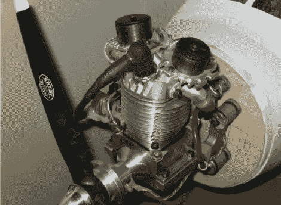

# 宣布下一个主题:引擎黑客

> 原文：<https://hackaday.com/2011/08/29/announcing-the-next-theme-engine-hacks/>

过去几周，我们发现了一些有趣的高压帖子。今天我们宣布下一个主题:引擎黑客。在接下来的两周里，我们每天都会发布一个关于一些有趣的引擎项目的新帖子。我们将展示一些项目，其中引擎是从零开始制造的，引擎被修改为以一种新的方式工作，或者引擎被以一种它最初没有预期的方式使用。如果你或你认识的人有一个有趣的项目，你认为可能很适合这个类别，请通过我们的[提示热线](http://hackaday.com/contact-hack-a-day/)让我们知道。

上图是一台 [EVIC](http://rbowes1.11net.com/dbowes/) (电子气门内燃)发动机。这种类型的发动机没有凸轮轴来驱动阀门。取而代之的是使用螺线管，并与一个小型处理器和一些传感器配对，以确定打开阀门的时间和时间。这种类型的发动机可以让你在连续可变的基础上改变进入气缸的燃料量。如果你把它和电子点火装置搭配起来，你甚至可以让发动机反向运转！