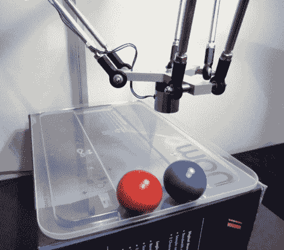

# Kinect 控制的 Delta 机器人具有磁性人格

> 原文：<https://hackaday.com/2011/08/23/kinect-controlled-delta-robot-has-a-magnetic-personality/>

[Malte]是一名忠实的 Hackaday 读者和神经生物学博士候选人，对机器人爱好有浓厚的兴趣——绝对是我们这类人！他写信分享了他在业余时间从事的一个项目，[一个由 Kinect 控制的 delta 机器人](http://www.mtahlers.de/index.php/robotik/delta-roboter-qdeltarq) ( [谷歌翻译](http://translate.google.com/translate?js=n&prev=_t&hl=en&ie=UTF-8&layout=2&eotf=1&sl=de&tl=en&u=http%3A%2F%2Fwww.mtahlers.de%2Findex.php%2Frobotik%2Fdelta-roboter-qdeltarq))。

就 delta 机器人而言，Deltares 这个名字非常简单。它使用三个伺服系统来驱动手臂，这些手臂由运行 BASCOM 的 AVR 微处理器控制。在 Kinect 捕捉到坐标数据后，AVR 通过串行连接从他的电脑中获取坐标数据。[Malte]选择使用微软的官方 SDK 进行该项目，使用他编写的一个小型 C#应用程序处理 Kinect 骨骼数据。

最终的结果是非常整洁的，正如你在下面的视频中看到的。在第一个视频中，[Malte]使用 Deltares 作为绘图仪，用马克笔在一张纸上画出一张粗糙的脸。在第二个场景中，他用右手指挥 Deltares，用左手激活电磁线圈来捡起钢珠。

这对我们来说看起来很酷，如果他最终把机器人作为他的职业而不是爱好，我们很想看看他会把什么样的东西放在一起。

 <https://www.youtube.com/embed/HgKmER2ZQyo?version=3&rel=1&showsearch=0&showinfo=1&iv_load_policy=1&fs=1&hl=en-US&autohide=2&wmode=transparent>

 <iframe class="youtube-player" width="800" height="480" src="https://www.youtube.com/embed/-Ub8LKPkhos?version=3&amp;rel=1&amp;showsearch=0&amp;showinfo=1&amp;iv_load_policy=1&amp;fs=1&amp;hl=en-US&amp;autohide=2&amp;wmode=transparent" allowfullscreen="true" style="border:0;" sandbox="allow-scripts allow-same-origin allow-popups allow-presentation"/> </body> </html>