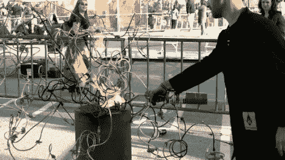

# 忘了那个无聊的老火坑，建个火焰树吧！

> 原文：<https://hackaday.com/2011/08/24/forget-that-boring-old-fire-pit-build-a-flame-tree-instead/>

Maker Faire 是一个非常值得参加的活动，不仅因为你可以看到各种很酷的设计和阴谋，还因为你可以参与其中。在 2011 年的 Maker Faire Bay Area，制造者[Brett Levine]组装了一个有趣的互动展示，他喜欢称之为 DIY 火焰树。

这个概念很简单，他说每个参与的人都从伸出援手中得到了很大的乐趣。每个参与者都得到一根铜管，并允许他们根据自己的喜好弯曲、扭曲和雕刻，然后用钻头在他们喜欢的地方钻孔。然后，他们可以选择在现有树上安装他们的项目部分。

每个人都站在离显示器安全距离的地方，[布雷特]给它充满丙烷，然后点燃各个部分。在下面的视频中，你可以看到显示器被风吹得有点乱，但我们想象它在一个安静的夏天晚上会看起来非常棒。

即使你对这种艺术不感兴趣，你也不得不承认这确实比无聊的老火坑强多了！

 <https://www.youtube.com/embed/Q_dOTN0GFmA?version=3&rel=1&showsearch=0&showinfo=1&iv_load_policy=1&fs=1&hl=en-US&autohide=2&wmode=transparent>

 </body> </html>