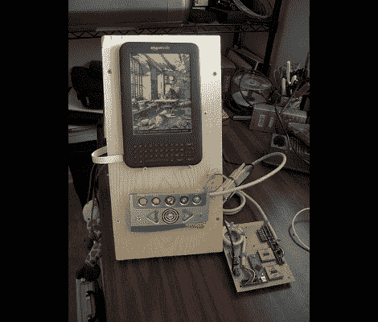

# 更多的科学进步

> 原文：<https://hackaday.com/2011/08/24/more-frankenkindle-progress/>

[Glenn]给我们发来了他的 FrankenKindle 项目的最新进展。你可能还记得七月的这个黑客[。[Glenn]正在改装这个装置，让他患有脑瘫的妹妹更容易使用。](http://hackaday.com/2011/07/28/frankenkindle-building-an-alternate-kindle-keyboard/)

最新版本增加了硬件外壳。银色的按钮垫是 V.Reader(一种儿童玩具)的残余部分，屏幕部分被砍掉了。这种外壳为阅读器和按钮提供了一个稳定的底座，可以将它们保持在一个很好的角度，方便使用。只有一点电缆布线需要完成，以保护一些脆弱的连接。上面的图片确实显示了电路板的一侧，但在后面有一个地方。

在广告之后的视频中，格伦提到对按键的反应有点迟钝。当然，这部分是 Kindle 自己在刷新 ePaper 显示屏时的延迟。但是我们不禁认为运行在 Teensy 上的代码也可以被优化。我们已经要求他张贴他的代码，如果他想要一些提示，所以回来看看，如果你能帮忙。

我们确实有一个功能建议给他。Kindle 键盘不再工作，因为连接它的是从旁边伸出的扁平电缆。给微控制器增加一个 PS/2 键盘端口是非常容易的。这将是对 FrankenKindle 的一个很好的补充，因为它将使买书这样的事情变得更加容易。

 <https://www.youtube.com/embed/roplxL3SgTg?version=3&rel=1&showsearch=0&showinfo=1&iv_load_policy=1&fs=1&hl=en-US&autohide=2&wmode=transparent>

 </body> </html>