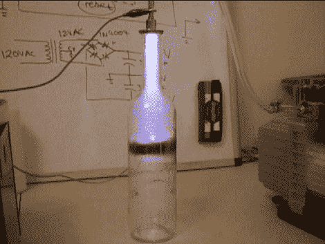

# DIY 电子加速器

> 原文：<https://hackaday.com/2011/08/30/diy-electron-accelerator/>

读者【Xellers】寄来了他的最新仪器: [DIY 电子加速器:一个装在酒瓶里的阴极射线管](http://www.instructables.com/id/DIY-Electron-Accelerator-A-Cathode-Ray-Tube-in-a-/)。虽然和你想象中的阴极射线管不太一样，但基本原理已经到位。一个酒瓶被用作真空室，一个 9kv 的氖变压器被连接到顶部的一个停止器上。阴极放在中间，用泵抽出空气，施加高电压。

自然地，随着更多的空气被抽出，电弧增强成一种非常固态的等离子体，充满了两个触点之间的空间。虽然将钻孔玻璃与真空和高压混合听起来像一个可怕的医院故事，但[Xellers]确实涵盖了一些安全要点，包括这种东西可能会产生一些讨厌的波。

有一件事没有提到(我看到的)，这与荧光灯管的工作原理非常相似，如果没有荧光材料内衬，它会发出相当多的紫外光(注意杀菌紫外光是清晰的)。所以你要注意你的眼睛！

休息之后，请加入我们，观看一段简短的视频。

[https://www.youtube.com/embed/pHAYYMNiawE?version=3&rel=1&showsearch=0&showinfo=1&iv_load_policy=1&fs=1&hl=en-US&autohide=2&wmode=transparent](https://www.youtube.com/embed/pHAYYMNiawE?version=3&rel=1&showsearch=0&showinfo=1&iv_load_policy=1&fs=1&hl=en-US&autohide=2&wmode=transparent)