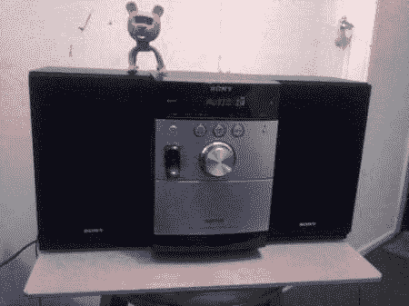

# 将蓝牙耳机制作成无线音乐流媒体设备

> 原文：<https://hackaday.com/2011/08/31/making-a-bluetooth-headset-into-a-wireless-music-streaming-device/>

这个[蓝牙耳机黑客](http://www.instructables.com/id/Bluetooth-Headset-Hack/)，虽然简单，但或许能提供一些黑客灵感。将蓝牙耳机变成立体声的无线输入绝对会让人想到“我怎么没想到呢？”如果你的黑客预算很紧，也很好，因为没有很多东西可以买。

除了可能损坏的耳机之外，还需要一个 3.5 毫米的立体声插头和一些电线。再加上一些每个优秀黑客都应该有的工具，比如烙铁和胶枪，你就可以开始了。[Dex]很好地描述了从拆卸耳机到将立体声插头连接到耳机的过程。进行转换时，必须记住桥接左右输出声道，因为大多数耳机仅输出单声道信号。

做这项工作不需要太多其他东西。可能是一个很好的初学者项目。另一个基于蓝牙的黑客使用了搜刮来的设备，看看这个手机控制的[复古无线电黑客](http://hackaday.com/2011/08/24/cellphone-controlled-retro-radio-stores-and-plays-your-digital-library/)。