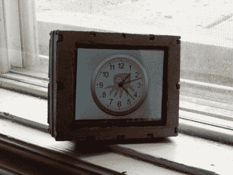

# Chumby 移植和硬件升级用于 DSLR 和 WFT

> 原文：<https://hackaday.com/2011/08/27/chumby-transplant-and-hardware-upgrade-used-with-dslr-and-wft/>

Chumby One 有一个漂亮的小盒子，配有一个带触摸屏界面的 ARM 供电板。[Bobby]认为这是一个很好的起点，但想要一个更便携的版本，作为无线文件传输设备用于摄影。WFT 是数码相机的连接增强功能，允许通过无线网络将图片推送到其他设备。

为了提高硬件的便携性,[Bobby]抛弃了设备自带的耗电的 WiFi 适配器。他正在使用的更新更高效的 USB 加密狗作为替代品，这使得切换到可充电的相机电池成为一个可行的选择。随着电池和加密狗焊接到电路板上，他抛弃了其余的硬件(除了触摸屏),开始自己的外壳工作。你可以看到上面的版本只是边缘有点粗糙，他[从谷歌 Sketchup 设计中用手](http://hackaday.com/2011/06/24/building-a-robot-without-using-a-machine-shop/)切下来的。但由于他计划为朋友们多制作几个这种硬件的副本，他可能会使用一种服务来为他激光切割这些外壳。

新的硬件需要驱动程序，而[Bobby]有很多关于如何编译你自己的驱动程序的指导。这包括设置工具链、编译内核以及构建驱动程序本身。