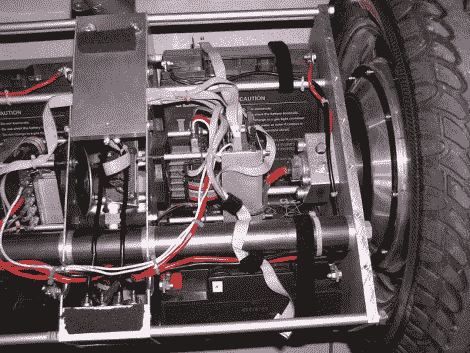

# DIY 赛格威:快速、安静、开放

> 原文：<https://hackaday.com/2011/08/28/diy-segway-fast-silent-and-open/>

这是一张 diy Segway 项目 ( [翻译](http://translate.googleusercontent.com/translate_c?hl=en&ie=UTF8&prev=_t&rurl=translate.google.com&sl=auto&tl=en&twu=1&u=http://rn-wissen.de/index.php/Rutscherle_-_selbstbalancierender_Elektroroller&usg=ALkJrhhMZVfqXW370o6Cr_IrW5SWATSyPA))的内脏图。所有的东西都放在骑手站立的平台下的一个小空间里。它很紧，但当菱形板覆盖所有内部时，它看起来很光滑。

ATmega644 控制车辆。它通过使用 PID 控制方案来监控陀螺仪，驱动车轮保持平衡中心。电子方面，最复杂的部分是电机控制器。好像是原创设计，用了一个 ATmega48 和其他几个集成电路。我们很难弄清楚这是如何实现的，但是通过对该模块中的三个原理图的深入研究，我们敢打赌您可以了解事情的真相。我们当然喜欢这个结果，因为这个私人交通工具非常安静。休息之后，请观看视频片段，亲自聆听。

**注意:**如果你重用顶部翻译链接的代码，要小心。Google translator 还翻译代码中的变量名，由于翻译中的不一致，可能会破坏它的工作方式。

 <https://www.youtube.com/embed/YAuZ9zhxNV8?version=3&rel=1&showsearch=0&showinfo=1&iv_load_policy=1&fs=1&hl=en-US&autohide=2&wmode=transparent>

 
[谢谢丹尼尔]
 </body> </html>