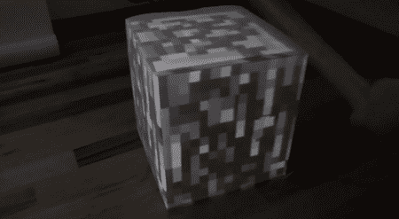

# 可开采的《我的世界》区块

> 原文：<https://hackaday.com/2011/08/29/mineable-minecraft-block/>

在 Hack A Day，我们是《我的世界》的超级粉丝，所以你可以想象当我们看到[本·波弟]的现实版《我的世界》·布洛克时我们的兴趣。该建筑使用投影系统将砖块显示在纸板盒上，并对被“开采”做出反应，就像游戏中一样。

块动画由压电传感器、Arduino 和加工草图处理。从[本的]博客上的早期帖子，我们将猜测他使用了~~[梯形视频投影库](http://keystonep5.sourceforge.net/)~~ 他自己的解决方案来将《我的世界》块映射到纸板盒上。动画的处理就像在《我的世界》一样——将断裂的动画叠加到砖块上，并添加一些粒子效果。

我们之前见过一些《我的世界》黑客，比如[将它用作 3D 设计工具](http://hackaday.com/2011/07/07/minecraft-is-now-a-3d-design-tool/)，以及[将你的红石 CPU 连接到外部世界](http://hackaday.com/2011/01/03/controlling-real-objects-using-minecraft/)。[本]的建造沿袭了其祖先的传统，是我们*真正想尝试的东西。休息后请观看演示。*

<https://player.vimeo.com/video/28096608>

 
<iframe src="https://player.vimeo.com/video/28098003" width="800" height="480" frameborder="0" webkitallowfullscreen="" mozallowfullscreen="" allowfullscreen=""/>
 
<iframe src="https://player.vimeo.com/video/28124800" width="800" height="480" frameborder="0" webkitallowfullscreen="" mozallowfullscreen="" allowfullscreen=""/>
 </body> </html>