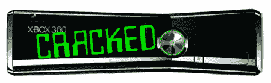

# 在任何 Xbox 上运行未签名的代码

> 原文：<https://hackaday.com/2011/08/29/run-unsigned-code-on-any-xbox/>

很多人发来了 Xbox 自制软件的最新进展。一个名为[GliGli]的主机黑客发布了一个新的漏洞，可以将*的任何* Xbox 引导至[的 Linux 加载程序](http://www.free60.org/XeLL)。

黑客需要一些硬件——在这种情况下是 Xilinx CLPD。黑客的工作原理是发送一个微小的复位脉冲(不知道“微小”是什么意思)来干扰硬件，并在启动期间绕过哈希检查。如果这对你来说还不够专业，可以查看[项目的 github](https://github.com/gligli/tools/tree/master/reset_glitch_hack) 上的[自述文件](https://github.com/gligli/tools/blob/master/reset_glitch_hack/reset_glitch_hack.txt)。

这不是破解 Xboxen 的灵丹妙药。每次启动时，该故障只有 25%的成功几率。这种故障还需要几分钟才能引导到未签名代码中。话虽如此，这种方法对所有 360 都有效，包括用 JTAG 方法无法打开的苗条模特。

休息后，查看一个测试者演示的演示。再次感谢大家发来这封邮件。

 <https://www.youtube.com/embed/JyYdL4L6vwE?version=3&rel=1&showsearch=0&showinfo=1&iv_load_policy=1&fs=1&hl=en-US&autohide=2&wmode=transparent>

 </body> </html>