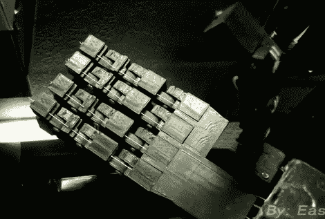

# [伊斯顿的]电子手获得 3D 打印升级

> 原文：<https://hackaday.com/2011/08/29/eastons-animatronic-hand-gets-3d-printed-upgrade/>

[伊斯顿]一直在和[杰里米·布鲁姆]合作，想出他的电子手的最新版本。你可能记得见过【伊斯顿的】[第一只电子手](http://hackaday.com/2011/03/28/wireless-animatronic-hand-control/)，用它他赢得了他的地区科学博览会，并进行一次国家旅行。从那以后，他一直致力于改进，通过使用(杰瑞米的)Makerbot，他利用开源设计的力量制作了自己的印刷手，扩展了[一个不同的 Thingiverse 项目](http://www.thingiverse.com/thing:2408)。

他还在用原来的传感器手套作为控制器。它通过 Xbee 模块向控制手臂的 Arduino 发送命令。从那里，玻璃纤维前臂内的五个伺服系统移动每个手指和拇指。休息后的视频剪辑给了[Easton]一个展示所有新设计功能的机会，并以手抓住不同物体的演示结束。我们有机会和他简短地聊了一下。他为自己设定了远大的目标，旨在设计一款价格低于 1000 美元的假肢。那不是一个职业目标…他想今年完成它。

[https://www.youtube.com/embed/xzLEB42pR5Y?version=3&rel=1&showsearch=0&showinfo=1&iv_load_policy=1&fs=1&hl=en-US&autohide=2&wmode=transparent](https://www.youtube.com/embed/xzLEB42pR5Y?version=3&rel=1&showsearch=0&showinfo=1&iv_load_policy=1&fs=1&hl=en-US&autohide=2&wmode=transparent)