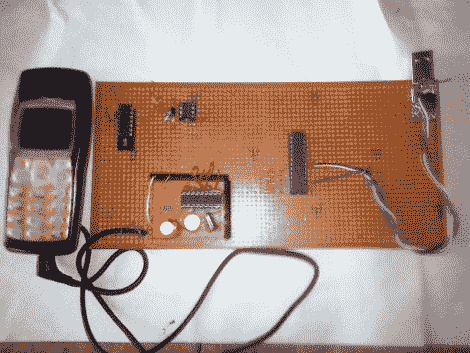

# 基于手机的交互式语音应答系统

> 原文：<https://hackaday.com/2011/08/30/a-cellphone-based-interactive-voice-response-system/>

我们都很熟悉 IVRS 系统，它可以让你通过按键式电话获取信息。[Achu Wilso]建立了他自己的版本，使用手机、微控制器和电脑。

手机由一个附有 555 定时器芯片的 LM324 运算放大器监控。当有电话进来时，耳机输出端的电压变高，启动定时器电路。如果它变低，并且在大约 25 秒内没有再次变高，通话将结束。每个传入的按键音充当电路的保持活动。

MT8870 DTMF(按键音)解码器芯片监控用户输入。ATmega8 微控制器从该芯片中获取解码后的按键音，并通过 USB 将其发送到 PC。PC 端软件用 Python 编写，使用 MySQL 绑定访问数据库信息。 [eSpeak](http://espeak.sourceforge.net/) ，开源的语音合成器软件用于将菜单和数据库信息读回给呼叫者。

这是一个不错的小系统，我们希望有一个音频剪辑，这样我们就可以听到它的运行。