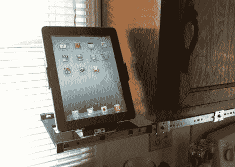

# 厨房用可伸缩 IPad 底座

> 原文：<https://hackaday.com/2011/08/30/retractable-ipad-dock-for-the-kitchen/>

[埃文·弗林特]和他的妻子在厨房里使用了很多网上的食谱。他们没有打印出来，而是买了一台 iPad 作为烹饪伴侣。但在他们狭小的厨房里，他需要为高端硬件找到一个位置，这个位置既偏僻又方便。一些抓头和零件箱潜水导致[这个橱柜下的 iPod 基座](http://battlesnake.blogspot.com/2011/08/undercounter-ipad-dock.html)。

坞站本身是一个由铝板制成的摇篮。切割成型后，[Evan]向上弯曲侧面和底部，使 iPad 居中。因为这不是一个永久的固定装置，他需要把摇篮折叠起来。他使用 CAD 程序设计了底座托盘，让摇篮平放，同时在使用时提供了几种角度选择。烹饪完成后，只需将其折叠起来，抽屉滑轨就可以轻松放在橱柜下。

因为房子不是他的，所以他不想对橱柜做永久性的改动。但他确实对抽屉滑轨未完成的外观感到遗憾。我们只是从家庭商店里拿了一些预制好的橡木冠模，然后把整个东西包起来。使用时，饰条的左边缘会随着支架滑出。