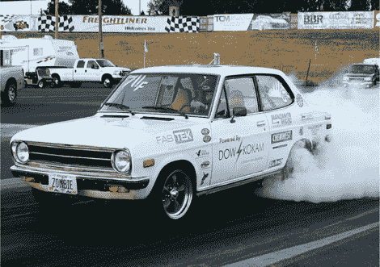

# 发动机黑客:电气化达特桑是最终的发动机更换

> 原文：<https://hackaday.com/2011/09/02/engine-hacks-electrified-datsun-is-the-ultimate-engine-swap/>

忘了特斯拉跑车吧，我们想要一辆像约翰·韦兰的白色僵尸一样的电动汽车！

如果它没有贴满赞助商的贴纸之类的东西，你永远不会意识到这辆不起眼的 72 年达特桑 1200 是一辆绝对的猛兽车。用来提供仅仅 69 马力的燃气发动机被一对定制的电动马达取代，这两个马达在不到两秒的时间内将达特桑推进到每小时 60 英里。

电动机提供 500 马力和惊人的 1250 英尺磅的瞬时扭矩，提供一个地狱般的旅程。该车由 12 个定制的 29.6 伏电池组供电，每个电池组提供 2400 安培的电流！除了在 11 秒内走完四分之一英里外，白色僵尸还可以在需要充电前跋涉 90 英里。

不用说，每次[约翰]上赛道，这辆令人印象深刻的车都会让很多人大吃一惊。继续阅读，看一个可怜的笨蛋痛苦地认识到他的全新玛莎拉蒂不是白色僵尸的对手。

[通过[发现](http://dsc.discovery.com/cars-bikes/worlds-fastest-electric-car-is-a-72-datsun-does-0-60-in-1-8-seconds.html)

[https://www.youtube.com/embed/vGQSQAz9v6c?version=3&rel=1&showsearch=0&showinfo=1&iv_load_policy=1&fs=1&hl=en-US&autohide=2&wmode=transparent](https://www.youtube.com/embed/vGQSQAz9v6c?version=3&rel=1&showsearch=0&showinfo=1&iv_load_policy=1&fs=1&hl=en-US&autohide=2&wmode=transparent)