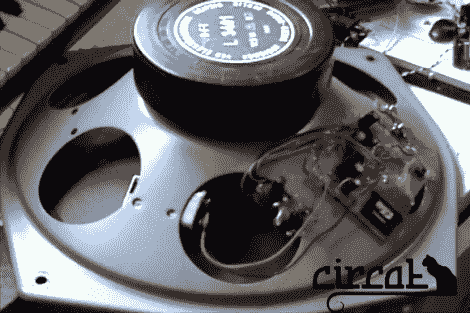

# 用于街头表演的扬声器安装 WAV 播放器

> 原文：<https://hackaday.com/2011/08/29/speaker-mounted-wav-player-for-street-performances/>

这个裸露的扬声器是 MaoMakMaa 最新[项目 Wavedrone](http://maomakmaa.blogspot.com/2011/08/simple-wav-player-lpf-and-lm386.html) 的基础。他计划在街头表演中使用这种自主的无线设备。休息后，您可以在视频剪辑中听到一些拉长的爵士乐线在上面播放的效果。这种声音是一种无形的背景噪音，观察者可能不会立即意识到它的存在。

你可以看到 9V 电池作为电源紧贴在扬声器的框架上。一个 7805 线性稳压器驯服电池，并馈入右边电路板上的两个 IC。ATtiny85 正在从 SD 卡中读取音乐，并在 LM386 音频放大器芯片的帮助下以单声道(显然)播放。微控制器和放大器之间的高通和低通滤波器中的微调端口允许进行一些声音处理，但我们对经过适当调整后的声音质量印象更深刻。

 <https://www.youtube.com/embed/WQrElaWKNJo?version=3&rel=1&showsearch=0&showinfo=1&iv_load_policy=1&fs=1&hl=en-US&autohide=2&wmode=transparent>

 </body> </html>