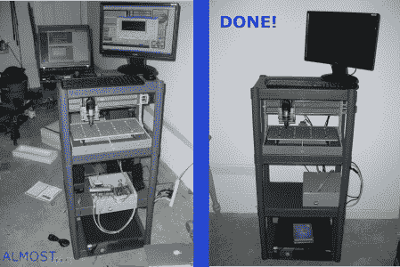

# 打造属于自己的数控路由器

> 原文：<https://hackaday.com/2011/09/01/building-a-cnc-router-to-call-my-own/>

和[HAD]的大多数作家一样，我喜欢做项目，就像我喜欢写项目一样。作为一名为电子博客写稿的机械工程师，一台 [CNC 路由器](http://www.jcopro.net/2011/08/30/first-dremel-tool-router-cuts-using-mach3-with-g-code/)似乎是我车库里需要的东西。建造这样的路由器需要一点电子和机械方面的专业知识，所以这似乎是一个很好的挑战。

这款路由器套件由 Zen Toolworks 制造，框架方面相当完整，但需要大量电气方面的知识才能正常运行。为了让它看起来体面，工作正常，我不得不依靠一些[拉链](http://www.jcopro.net/2011/08/21/how-to-set-up-your-cnc-router-part-2-wiring-and-electronics/)和基本的[诊断技能](http://www.jcopro.net/2011/08/27/computer-and-electrical-issues-encountered-while-setting-up-a-zen-toolworks-cnc-router-and-how-they-were-fixed/)，这是我作为一名前工程合作者和技术员磨练出来的。此外，当我们在车库停放两辆车时，我必须想出一个便宜地将所有东西堆放在车库里的方法(占地面积是 14 英寸 x 22 英寸，所以我认为这是成功的)。

在这个项目中，我仍然需要克服的一个更大的挑战是学习[“g 代码”](http://en.wikipedia.org/wiki/G-code)以及如何使用软件来生成它。虽然我已经做了一些基本的编程，正如在休息后的视频中看到的，但还有很多东西要学。我希望有这个工具可以带来更好的项目，因为我不会再被限制在简单的磨线和圆上了。

至于我作为一名工程师的工作，我很少被要求自己加工零件，但是，在设计机械时，有这个背景会有很大的帮助。此外，作为一名制造工程师，我处理的几乎所有事情都涉及某种电子产品，因此对这一点有一个基本的了解是非常重要的。我鼓励任何想进入这个领域的人尽可能多地学习电子学和事物的一般工作原理。[【HAD】](http://hackaday.com/)是这方面的一个很好的来源，所以请继续阅读并提交您的建议吧！

作为奖励，这是另一个定格视频[一切都在一起](http://www.jcopro.net/2011/06/26/assembling-the-ztw-7x12-kit/):

 <https://www.youtube.com/embed/CbErot0NV4g?version=3&rel=1&showsearch=0&showinfo=1&iv_load_policy=1&fs=1&hl=en-US&autohide=2&wmode=transparent>

 </body> </html>