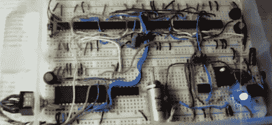

# 带逻辑芯片的密码锁

> 原文：<https://hackaday.com/2011/08/30/knock-lock-with-logic-chips/>

[Eric]在他的数字逻辑设计课上需要一个项目，他决定用一把锁来响应特定的敲击模式。这是一个相当常见的项目，我们已经[见过](http://hackaday.com/2009/12/22/rhythmic-combo-lock/)一个[少数](http://hackaday.com/2009/11/04/knock-detecting-lock/) [用“敲锁”构建](http://hackaday.com/2007/06/11/knock-response-automatic-door-opener/)，但是这个没有使用微控制器。相反，它使用单独的逻辑芯片。

这种锁通过压电感应敲击声，就像我们见过的其他建筑一样。与其他构建不同，爆震模式随后被数字化并存储在 EEPROM 中。[Eric]这个构建只使用了 12 个芯片，他可以通过一些数字技巧来完成这个壮举，比如通过将一个 XOR 输入连接到高电平来制作一个反相器。

我们以前见过基于 [555 的敲锁](http://www.electrobob.com/secret-knock-detector-with-555/)，但是获得正确的时间似乎有点令人抓狂。[Eric]的构建看起来更加用户友好，并且具有通过敲击而不是转动电位计来编程的额外好处。休息之后看看[Eric]的敲门信号。

编辑:修复了链接。

[https://www.youtube.com/embed/fvPfXka4dDY?version=3&rel=1&showsearch=0&showinfo=1&iv_load_policy=1&fs=1&hl=en-US&autohide=2&wmode=transparent](https://www.youtube.com/embed/fvPfXka4dDY?version=3&rel=1&showsearch=0&showinfo=1&iv_load_policy=1&fs=1&hl=en-US&autohide=2&wmode=transparent)