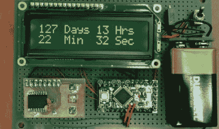

# 裸机电子降临节日历

> 原文：<https://hackaday.com/2011/08/31/bare-bones-electronic-advent-calendar/>

现在已经是正式的九月了(在世界的一些地方)，这意味着在过去的几周里，我们已经看到了 Costco，Walmart 和 Target 地板上的圣诞装饰品。作为对现实的一个小测试，[Eric]决定制作一个电子降临节日历，它可以倒计时到圣诞节的天数。作为一个使用放在长凳上的零件的简单构建，[Eric]在推迟他的孩子的问题“离圣诞节还有多久？”方面做得相当好一台机器。

构建相当简单，仅使用 Arduino Pro Mini、RTC 和 LCD 显示器。对于实时时钟，[Eric]使用了曾经流行的[ds 3231 RTC。](http://hackaday.com/2009/10/27/parts-chronodot-rtc-module-ds3231/)[软件](http://physics.csuchico.edu/~eayars/code/countdown.pde.html)从时钟中读取时间，并计算当前时间和硬编码目标日期之间的秒数。

所有东西都由 9 伏电池供电，这种电池撑不了剩下的 115 天，直到圣诞节。有一个电源开关，RTC 有一个备用电池，所以这个版本可能足以满足除了最狂热的孩子。