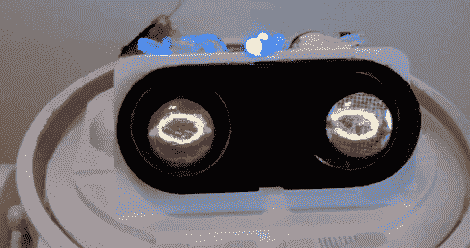

# 用谢妮管做机器人的眼睛

> 原文：<https://hackaday.com/2011/09/01/using-nixie-tubes-as-robot-eyes/>

[拉德梅克]在 ez-robot.com 论坛上提出了谢妮管的一个很好的用途。他没有用数码管做时钟或显示数值，而是把它们用作机器人的眼睛。

他使用由 Arduino 驱动的数码管驱动器为电子管供电。[radmeck]对 arduNIX 套件印象深刻。该套件能够驱动 8 个 Nixies 或 80 个 neon 灯泡，但没有来自[radmeck]的关于他的建筑中的额外 Nixies 或 neon 的消息。该项目的最终目标是重建 Omnibot，同时添加更多的伺服系统和电机。 [EZ-B 机器人控制器](http://www.ez-robot.com/)将被用来控制机器人，[一些我们以前见过的](http://hackaday.com/2011/02/19/bluetooth-tomy-omnibot-hack/#more-35356)。

【拉德梅克】的 Omnibot 在洗完明亮的澡后看起来好多了，有了谢妮的眼睛，它更可爱了。虽然 Omnibot 没有实现最初的承诺[给你的女朋友](http://www.youtube.com/watch?v=-T5649aTuVs&t=16)留下深刻印象，但 Nixie tube eyes 会给你一些博客信誉。

休息之后，看看改进后的 Omnibot 的视频。

[https://www.youtube.com/embed/5k15Sq1plNk?version=3&rel=1&showsearch=0&showinfo=1&iv_load_policy=1&fs=1&hl=en-US&autohide=2&wmode=transparent](https://www.youtube.com/embed/5k15Sq1plNk?version=3&rel=1&showsearch=0&showinfo=1&iv_load_policy=1&fs=1&hl=en-US&autohide=2&wmode=transparent)