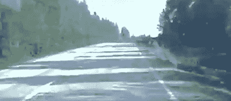

# 基于高速公路的原声录音

> 原文：<https://hackaday.com/2011/09/01/highway-based-soundtrack-recordings/>

(Urpo Lankinen)的父亲是一个超级电影迷，一旦你深切关注某样东西，它就会开始出现在你所看到的任何地方。一天，在一条偏僻的公路上行驶时，[Urpo]的父亲注意到公路上树木的影子[看起来像一部光学电影的配乐](http://www.beastwithin.org/users/wwwwolf/blog/2011/08/sounds-of-the-road.html)，所以这取决于儿子。

早期的有声电影技术，如 RCA Photophone 和 T2 movie tone，用可变面积曝光将音频录制到胶片上。该曝光对应于音频信号的波形。[Urpo]认为他的小型数码摄像机与投影仪内部的音频传感器具有相同的用途，所以他在镜头上放了一张薄纸，最终得到了一段只有灰色画面的视频。

【Urpo】在[处理](http://processing.org/)中内置了一个应用，可以平均视频每一帧的像素。当然，以 30 帧/秒的速度录制不会以这种方式产生任何音频，所以他在 Audacity 中用这些数据调制了一个三角波。最后，它听起来真的不怎么样，但看到这样一个令人讨厌的构建真的很棒。

我们很想在休息后发布视频，但[Urpo]不相信 YouTube 嵌入。我们会尊重他的意愿，所以你可以在这里查看视频。