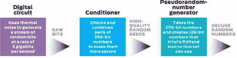

# 英特尔从数字有序性中创造随机性的新方法

> 原文：<https://hackaday.com/2011/09/02/intels-new-way-of-creating-randomness-from-digital-orderliness/>

在涉及加密和安全的项目中，随机数生成是一个经常讨论的话题。[英特尔刚刚宣布了许多处理器的一项新功能](http://spectrum.ieee.org/computing/hardware/behind-intels-new-randomnumber-generator/0)，该功能会影响随机数的生成。

他们称之为 Bull Mountain 的随机数生成器标志着英特尔从模拟硬件生成随机数种子的传统方法的偏离。Bull Mountain 依靠全数字硬件，让两个逆变器相互对抗，让热噪声将指针指向一个方向或另一个方向。在此过程中，系统会在几个步骤中受到监控，调整硬件以确保随机数字不会更频繁地出现在一个方向或另一个方向。然后，成对的 256 位序列经过一个数学过程，以进一步抵消可预测性的机会，然后将它们用作伪随机数种子。为什么要经历这一切？过渡到全数字工艺使缩小微芯片的尺寸变得更容易、更便宜。

添加了一条新指令来访问这个硬件模块:RdRand。如果它像承诺的那样工作，这将消除对作为随机数源的外部硬件的需求。

[via [Reddit](http://www.reddit.com/r/programming/comments/k0y50/behind_intels_new_randomnumber_generator/)