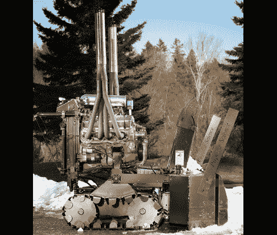

# 引擎黑客:吹雪——因为吹雪是为普通人准备的

> 原文：<https://hackaday.com/2011/09/06/engine-hacks-snow-chucking-because-snow-blowing-is-for-commoners/>

冬天来了，你不想被邻居的新吹雪机超过。我们认为，如果你能围绕 V8 发动机建造自己的吹雪机，那么可以很有把握地说，你将成为整个社区齿轮爱好者羡慕的对象。[Kai Grundt]白天是一个金属制造者，晚上是一个~~恐怖电影道具~~庭院工具建造者。他把引擎从他的雪佛兰卡车上拆下来，然后在周围装上零件，制成了这台 412 马力的吹雪机。

它所乘坐的坦克履带都有自己专用的液压泵，这使得驾驶和驾驶这条 800 磅重的鲸鱼变得很容易。这头野兽的第一个命令是从两栋房子外扔雪，埋掉他朋友的车。这就是当一个人描述他的下一个项目时，当着他的面大笑的代价。听起来似乎[Kai]计划出售套件，这样你可以更容易地复制构建，但我们找不到任何其他信息。如果你知道详情，请留言告诉我们。

[谢谢 Danman1453]