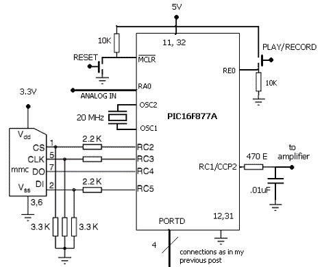

# 基于 PIC 的语音记录器

> 原文：<https://hackaday.com/2011/09/03/pic-based-voice-recorder/>

[Vinod]刚刚完成了录音机的制作，结果比他想象的还要好。休息后的视频显示，他用手机录制了你最喜欢的歌曲之一，然后播放。对于组件非常少的项目来说，音频质量听起来确实不错。

一个 PIC 16F877A 构成了大部分的建设。它的 ADC 用于捕捉来自放大麦克风输入的输入线路(你会在他的文章中间找到放大器原理图)。他将数据存储在 MMC 卡上，这有点麻烦，因为 PIC 有限的 RAM 来管理这种开销。存储的数据是原始格式，因为卡不是使用文件系统访问的。这使得以高比特率录音变得容易，从而带来更好的音频质量。回放包括通过低通滤波器和放大器电路将扬声器连接到 PIC 上的硬件 PWM 输出。

[https://www.youtube.com/embed/Mn1VsM-i8QI?version=3&rel=1&showsearch=0&showinfo=1&iv_load_policy=1&fs=1&hl=en-US&autohide=2&wmode=transparent](https://www.youtube.com/embed/Mn1VsM-i8QI?version=3&rel=1&showsearch=0&showinfo=1&iv_load_policy=1&fs=1&hl=en-US&autohide=2&wmode=transparent)