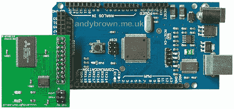

# 升级 Arduino Mega 中的 RAM

> 原文：<https://hackaday.com/2011/09/05/upgrading-ram-in-an-arduino-mega/>

[Andy]在 Arduino Mega 上增加了一些内存，他的三部分走查是关于[设计](http://andybrown.me.uk/ws/2011/08/28/512kb-sram-expansion-for-the-arduino-mega-design/)、[构造](http://andybrown.me.uk/ws/2011/08/28/512kb-sram-expansion-for-the-arduino-mega-design/)和[软件](http://andybrown.me.uk/ws/2011/08/28/512kb-sram-expansion-for-the-arduino-mega-software/)的，这是一本很好的读物，也是我们见过的更“硬核”的 Arduino 版本之一。

构建围绕一个 [512K × 8 SRAM 模块](http://pdf1.alldatasheet.com/datasheet-pdf/view/124447/ALSC/AS7C4096A.html)【PDF 警告】。因为 RAM 被分成大约 512，000 个 8 位的块，Arduino 必须通过 16 条“地址线”访问 RAM，然后通过 8 条“数据线”发送数据。[Andy]不想用完他的 Arduino 上的 24 个引脚，所以他使用一个锁存器将最低的 8 个地址线和数据线复用在一起。安装了 512KB RAM 扩展后，Mega 能够处理高达 520 kb 的数据。

我们已经看到一些构建受到 Arduino 中可用 RAM 数量的限制，如[捕捉视频](http://hackaday.com/2011/06/07/capturing-video-with-an-arduino/)和一些机器人黑客，给这些构建添加更多的 RAM 会很好。使用锁存器多路复用数据和地址线可以进一步扩展，但 520KB 对任何人来说都应该足够了。