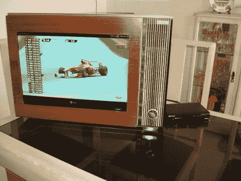

# 电视翻新……因为平板电视不占地方

> 原文：<https://hackaday.com/2011/09/06/tv-retrofit-because-flatscreens-just-dont-take-up-enough-space/>

[伊戈尔]帮助他朋友的家人用新的平板电视改装一台旧的 Philco 电视([翻译为](http://translate.google.com/translate?sl=auto&tl=en&js=n&prev=_t&hl=en&ie=UTF-8&layout=2&eotf=1&u=http%3A%2F%2Figorplaca.blogspot.com%2F2011%2F09%2Frestauracao-tv-philco-ford-anos-70.html))。原版在 30 多年前就已经废弃了，但它的外观仍然保留着对他女朋友祖母的一丝怀念。在最近的一次拜访中，她给他看了这幅画，并问他是否可以修复。他告诉她，它很可能再也不会工作了，但他可以使用现代组件来取代屏幕，同时保留外壳本身。

像这样的旧硬件最好的一点是，你实际上可以相当容易地把外壳拆开。在移除了显像管和电子设备之后，他描绘了一个开口的图案，他可以带着这个图案去电子商店寻找一台可以填充开口的电视机。手里拿着新屏幕，他发现使用 VESA 安装支架的螺纹孔可以很容易地安装在旧外壳中。一根钢条固定在他切割和钻孔的板上，以匹配电视的孔模式。现在，奶奶很高兴有一个现代高清图片的复古外观的情况。