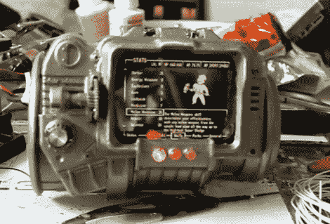

# 放射性坠尘带来的生活与这个工作 PIP-Boy 3000

> 原文：<https://hackaday.com/2011/09/06/fallout-brought-to-life-with-this-working-pip-boy-3000/>

[MyMagicPudding]想在 hobby electronics 一试身手，所以他决定全力以赴，为自己造一台 PIP-Boy 3000。如果这个名字听起来不耳熟的话，PIP-Boy 3000 是一款腕戴式电脑，来自流行的电子游戏系列。

PIP-Boy 基于 HTC Desire HD 手机，该手机安装在来自[副本道具论坛的【Skruffy】为他定制的外壳内。](http://www.therpf.com/)他想保持游戏的真实性，所以腕戴式电脑的界面避开了 Desire 的触摸屏，而是通过它表面的一组按钮和转盘来控制。外部输入都通过 Arduino Uno 与 Desire 连接，Arduino Uno 通过 USB 使用 TCP 与手机通信。

虽然他承认他的焊接技术相当不可靠，而且在整洁的外表后面已经没有空间在他的手腕上安装 PIP-Boy，但我们认为它看起来很棒。如果这是他第一个电子项目的例子，我们迫不及待地想知道接下来会发生什么。

请继续阅读，了解 PIP-Boy 3000 的运行情况。

 <https://www.youtube.com/embed/5tCEXEuICWs?version=3&rel=1&showsearch=0&showinfo=1&iv_load_policy=1&fs=1&hl=en-US&autohide=2&wmode=transparent>

 </body> </html>