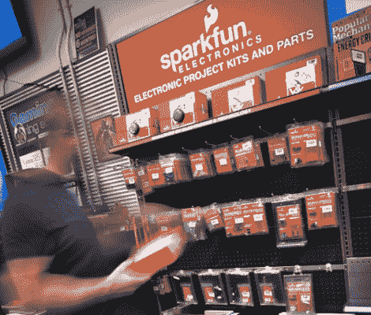

# 紧要关头需要什么吗？SparkFun 产品现在在微中心

> 原文：<https://hackaday.com/2011/09/07/need-something-in-a-pinch-sparkfun-products-now-at-micro-center/>

如果你碰巧住在微中心零售店附近，那么你现在很幸运，在购买 DIY 电子元件时有了另一种选择——spark fun 在所有微中心零售店都有销售他们的产品。

虽然 SparkFun [似乎在 6 月](http://www.sparkfun.com/news/635)宣布了这一变化，但我们今天看到这个话题有相当多的讨论。我们非常确定他们的整个目录不会在商店里提供，但他们承诺“在全国所有 23 个微中心地点提供广泛的 SparkFun 产品。”

众所周知，在构建自己的个人电脑时，Micro Center 是 SparkFun 的合理选择。肯定有这样的时候，你需要/想要一个零件，而不是等待它发货，所以这似乎是黑客和制造商在微中心零售店范围内的理想情况。

这一声明无疑让我们想知道这是否会是无线电小屋棺材中的最后一颗钉子。虽然微中心没有 Radio Shack 那样的市场渗透率，但更广泛的组件选择和友好、知识丰富的员工使 spark fun/微中心的组合非常有吸引力。

你有什么想法？请在评论中告诉我们。