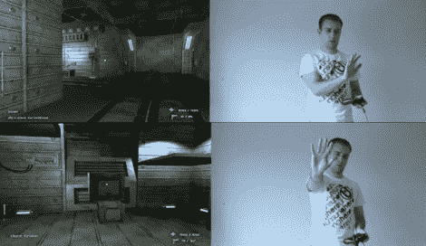

# 使用 Xbox 游戏手柄和 Kinect 的混合控制方案

> 原文：<https://hackaday.com/2011/09/07/hybrid-control-scheme-using-an-xbox-game-pad-and-kinect/>

Kinect 是一种有趣的动物。一方面，这对于黑客来说太棒了——这不是它的设计目的。另一方面，当谈到游戏时，它“还可以”——这是它存在的全部理由。

关于 Kinect 的控制方案，最大的抱怨之一是它对第一人称射击游戏没有好处，在这些游戏中，大部分动作涉及行走、跳跃和瞄准。对于他的硕士项目，[Alex Poolton] [做了一个奇妙的演示](http://www.youtube.com/watch?v=WlKcgtABcqk)，展示 Kinect 如何与标准 Xbox 控制器配对，以提供混合游戏输入。

虽然你可能会期待一个简单的游戏来展示混合控制系统的基本原理，但他已经制作了一个完整的游戏演示来展示这种控制方案如何在真实的游戏中实现。[亚历克斯]承认，它仍然有点粗糙的边缘，但他的设计有一些真正的潜力。

继续阅读，观看[Alex 的]项目的视频演示，并确保[查看他的博客](http://alexpoolton.squarespace.com/)了解关于该项目的新闻和更新。

[https://www.youtube.com/embed/WlKcgtABcqk?version=3&rel=1&showsearch=0&showinfo=1&iv_load_policy=1&fs=1&hl=en-US&autohide=2&wmode=transparent](https://www.youtube.com/embed/WlKcgtABcqk?version=3&rel=1&showsearch=0&showinfo=1&iv_load_policy=1&fs=1&hl=en-US&autohide=2&wmode=transparent)