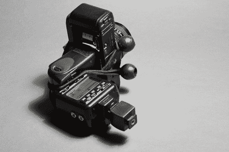

# 饼干放映机用的是你那台积满灰尘的胶片相机

> 原文：<https://hackaday.com/2011/09/07/cookie-projector-uses-that-dusty-film-camera-of-yours/>

这个技巧不适合心脏不好的摄影师。我们将讨论如何摧毁单镜头反光相机的机身。但是毁灭会带来新的东西。一台配有闪光灯和功能光学器件的坏相机可以用来[为图片背景](http://www.diyphotography.net/convert-your-old-camera-to-a-backdrop-projector-in-10-easy-steps)投射光图案。

这种硬件通常被称为 cookie 投影仪，一个商用设备可能需要几百美元。但是，如果你或你认识的人有一部非功能性单反相机，你就已经在制作自己的相机的路上了。只要掰下后盖，猛拉出镜子和快门，血腥的部分就结束了。带上一个大光圈的镜头，用你想在图像中看到的图案制作你自己的幻灯片，并在相机机身背面的大孔上贴上闪光灯。休息后的视频显示，diy 饼干投影仪挂在闪光灯架上，与你的 DSLR 闪光灯同步，为照片增添一些活力。

【维梅奥 http://vimeo.com/26779311 w = 470】