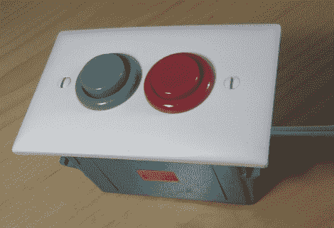

# 用这个街机按钮灯开关点亮你的工作室

> 原文：<https://hackaday.com/2011/09/07/light-up-your-workshop-with-this-arcade-button-light-switch/>

[皮特·米尔斯]在网上浏览时，偶然发现了一个街机按钮灯开关，并立即想要一个。然而，他不想支付 35 美元的要价，所以他决定自己制作。

他说，他那台孤零零的街机不值得拥有自己的房间，所以他想把开关接到工作室的延长线上。开关是用他手头的零件做的，所以看到他没有任何三端双向可控硅开关，他选择用一个继电器来代替。他考虑如何为开关构建一个简单的触发器电路，并决定使用一个简单的基于 555 的电路来代替一对晶体管。

最终的结果看起来和网上销售的版本一样好，正如你在下面的视频中看到的那样，效果非常好。[Pete]在他的网站上有电路原理图，如果你想自己制作，请在评论中告诉我们——我们希望看到电路设计的不同变化。

[https://www.youtube.com/embed/hJLqrkK4mJA?version=3&rel=1&showsearch=0&showinfo=1&iv_load_policy=1&fs=1&hl=en-US&autohide=2&wmode=transparent](https://www.youtube.com/embed/hJLqrkK4mJA?version=3&rel=1&showsearch=0&showinfo=1&iv_load_policy=1&fs=1&hl=en-US&autohide=2&wmode=transparent)