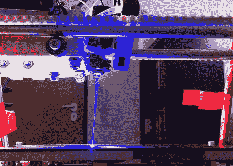

# 激光蚀刻印刷电路板生产

> 原文：<https://hackaday.com/2011/09/09/laser-etched-pcb-production/>

像我们大多数人一样，[reonarudo]对目前自制 PCB 的方法不满意，所以他在 reprap 上放了一束激光，并开始烧一些电路板。

基本程序是用哑光黑色喷漆覆盖覆铜板。一台激光器安装在 reprap 的 X 托架上。[reonarudo]使用 [cad.py](http://makeyourbot.org/cad-py) 将电路板文件转换成 g 代码，并启动他的激光器。电路板的质量高度依赖于激光的精度，因此[在解决了一些机械问题](http://reonarudo.info/blog/?p=47)【雷奥纳鲁多】成功制造了一些[还过得去的电路板](http://reonarudo.info/blog/?p=88)。

我们已经看到了几乎所有可以想象到的应用于 PCB 生产的制造方法。抗蚀剂和调色剂转移可以完成这项工作，一台 [reprap 铣床](http://hackaday.com/2009/09/19/reprap-milling-machine/)相当不错，但是激光要酷得多。虽然它可能还不完美，但用激光印刷 PCB 显示出了很大的潜力。休息之后，看看[reonarudo]的机器人烧一些铜的视频。

 <https://www.youtube.com/embed/Chq6TcTeDJc?version=3&rel=1&showsearch=0&showinfo=1&iv_load_policy=1&fs=1&hl=en-US&autohide=2&wmode=transparent>

 </body> </html>