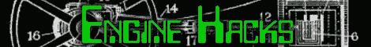
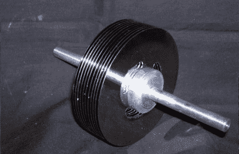

# 引擎黑客——特斯拉涡轮机

> 原文：<https://hackaday.com/2011/09/09/engine-hacks-tesla-turbines/>

你可能没有想到一个基于(尼古拉·特斯拉的)工作的项目会出现在引擎黑客主题中。大多数人知道他是因为他在高压设备方面的开创性工作。然而，[特斯拉]设计了一种后来被称为特斯拉涡轮机的装置。特斯拉涡轮机是由一系列附着在中心转子上的薄圆盘制成的。空气或蒸汽在圆盘的外缘注入封闭的涡轮机壳体。它通过涡轮叶片旋转，最终在转子附近排出。这种类型的涡轮机可以实现非常高的转速，但没有很大的扭矩，这限制了它们的实用性。看看这个说明性的，它向你展示了如何用硬盘制作你自己的特斯拉涡轮机。

我们在过去的 Hackaday 上展示了一个特斯拉涡轮机。在上一篇文章中，【Rick】向我们展示了如何用由其中一个涡轮机驱动的锯条来雕刻南瓜。