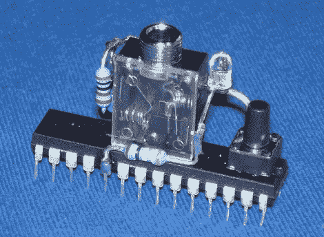

# 使用您的声卡为 Arduino 编程

> 原文：<https://hackaday.com/2011/09/09/program-an-arduino-using-your-sound-card/>

[Chris]写信给我们，分享他在项目中使用的 Arduinos 编程技术。他喜欢构建基本的 Arduino 克隆，而不是牺牲完整的开发板，并且他没有通过传统方式对它们进行编程，而是使用他计算机的声卡。

他用几个电阻、一对电容、一个 LED、一个复位开关，以及最重要的——一个音频插孔，构建了一个简单的死虫 Arduino(他称之为 Audioino)。在芯片上烧录了一个特殊的音频引导程序后，他可以将 Arduino 直接连接到电脑的扬声器端口进行编程。

一旦微控制器连接到他的计算机，他就通过自己创建的 Java 应用程序运行 IDE 生成的十六进制文件，该应用程序将数据转换为 WAV 文件。Arduino 进入编程模式后，他只需用音频播放器播放 WAV 文件，代码就会上传。

他说，这种编程方法在他为朋友开发东西的某些情况下很方便，因为他们可以很容易地自己更新软件，而不会有很多麻烦。