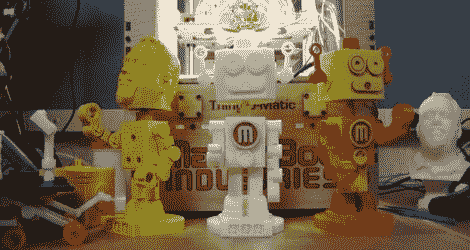

# 打印最佳吉祥物，赢得闪亮的新 Makerbot

> 原文：<https://hackaday.com/2011/09/09/print-the-best-macot-win-a-shiny-new-makerbot/>

如果你一直想要一台 3D 打印机，这是你赢得一台的机会。Makerbot 工业公司希望互联网为他们设计一个新的吉祥物。竞赛的获胜者将会得到一个 Makerbot 的自动装置。

不要担心这场比赛是先有鸡还是先有蛋。你实际上并不需要打印你的设计(虽然适印性是评判时考虑的一个品质)。你需要做的就是在 9 月 28 日截止日期前上传你的设计文件。设计必须以机器人为主题，任何作为私人上传的东西将在比赛结果公布后公开。浏览所有的提交材料应该会很有趣。还有其他几个设计限制，所以在开始工作之前，请务必仔细阅读。

那些宁愿用烙铁工作也不愿设计塑料机器人部件的人不必绝望。您不会错过 7400 逻辑竞赛的截止日期，该竞赛将在 10 月 21 日之前接受报名。