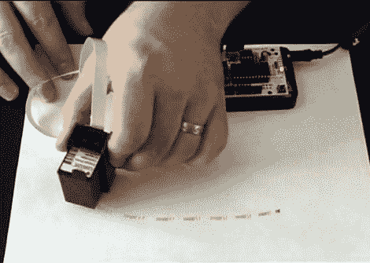

# 喷墨打印头驱动器护罩

> 原文：<https://hackaday.com/2011/09/12/inkjet-print-head-driver-shield/>

[尼古拉斯·C·刘易斯]正在为 Arduino 生产[喷墨打印头护罩套件。如果你一直想在项目中给物品贴上标签或品牌，这将大大简化这个过程。使用他的全通孔设计，Arduino 可以以 96 dpi 打印。起初，我们很难弄清楚我们可以用这个概念做什么，但是[Nicolas]找到了答案。在常见问题中，他链接到几个他自己的基于早期原型的平板喷墨打印机，但他也链接到使用相同概念的其他项目，如](http://www.kickstarter.com/projects/1908026860/inkshield-an-open-source-inkjet-shield-for-arduino)[的镍-O-Matic](http://hackaday.com/2009/03/24/nickel-o-matic/) ，或乒乓球打印机(休息后我们嵌入了该项目的视频)。

该屏蔽仅需要与微控制器的五个连接。我们喜欢[Nicolas]选择的基于跳线的连接系统，通过选择不同的驱动引脚，您可以同时使用多个打印头。该项目仍在筹资阶段，但已经获得了过多的资金。原理图和代码将在第一次生产运行完成后立即发布。

[https://www.youtube.com/embed/8Ep5OC3E02I?version=3&rel=1&showsearch=0&showinfo=1&iv_load_policy=1&fs=1&hl=en-US&autohide=2&wmode=transparent](https://www.youtube.com/embed/8Ep5OC3E02I?version=3&rel=1&showsearch=0&showinfo=1&iv_load_policy=1&fs=1&hl=en-US&autohide=2&wmode=transparent)

[感谢黑客空间]