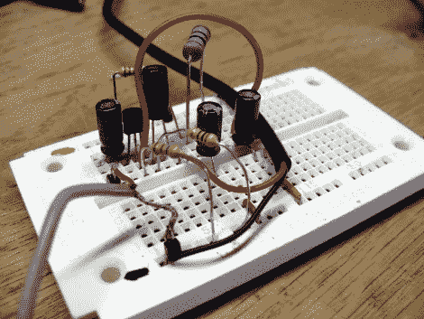

# 带压电拾音器的 JFET 吉他前置放大器

> 原文：<https://hackaday.com/2011/09/12/dinos-jfet-guitar-preamp-with-piezo-pickup/>

本周，在 Roomba 的帮助下，[迪诺]制作了一个听起来很棒的吉他拾音器和前置放大器。拾音器接收吉他的振动，并将其转化为电信号，然后放大并播放。他抓住了一只死去很久的 Roomba，它缓慢但肯定地为他的每周项目捐赠器官。在取出一个压电元件后，他抓起一包结型栅极场效应晶体管(JFET)，并在其中一个周围建立了一个前置放大器电路。

JFETs 的工作方式与 MOSFETs 非常相似(上周我们看了一下)。[Dino 的]设计增加了一些电阻和电容来调谐增益，并将电路与输入和电源轨去耦。他在吉他内部用环氧树脂粘合压电元件，并在它和安装在琴体上的插孔之间连接导线。一如既往，他出色地解释了设计背后的概念，并概述了他所使用的构建技术。休息之后我们嵌入了他的视频。

 <https://www.youtube.com/embed/AzW69IPEvys?version=3&rel=1&showsearch=0&showinfo=1&iv_load_policy=1&fs=1&hl=en-US&autohide=2&wmode=transparent>

 </body> </html>