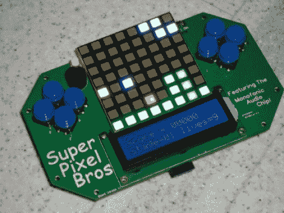

# 超级像素兄弟现在制造的 PCB 和重写的软件

> 原文：<https://hackaday.com/2011/09/12/super-pixel-bros-now-with-manufactured-pcb-and-rewritten-software/>

[复古布拉德]用他的 8×8 游戏设备取得了很大进展，他称之为 Super Pixel Bros。最新版本有[fab house PCB 和新重写的代码](http://www.bradsprojects.com/electronics/Bradsprojects-SuperPixelBros.html)。游戏仍然在 8×8 的 LED 矩阵上运行，但看起来他的版本是方形像素的，这是一个很好的接触，因为他的灵感来自基于块的超级马里奥游戏。在这个版本中还有一个新的功能是字符 LCD 屏幕，可以显示分数、等级和生活信息。但不同的不仅仅是闪亮的新硬件，他用剑鱼 Basic 重写了软件，以便在 PIC 18F4550 上运行。新代码允许他调整级别的加载和存储方式。他甚至写了一个关卡编辑器，到目前为止已经完成了 20 关。

休息后的演示在展示硬件和游戏方面做得很好。他增加了很多，包括敌人，射击的能力，当然还有跳跃和打破方块的常见动作都在那里。他提到他使用的 fab house 正在以大约 5 美元的价格出售主板，他正在研究启动和运行套件服务的可能性。

自从我们上次在项目上登记以来，他的进步令人印象深刻。

[https://www.youtube.com/embed/7sEUDSz9XuY?version=3&rel=1&showsearch=0&showinfo=1&iv_load_policy=1&fs=1&hl=en-US&autohide=2&wmode=transparent](https://www.youtube.com/embed/7sEUDSz9XuY?version=3&rel=1&showsearch=0&showinfo=1&iv_load_policy=1&fs=1&hl=en-US&autohide=2&wmode=transparent)