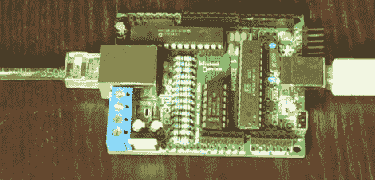

# 通过以太网上传固件

> 原文：<https://hackaday.com/2011/09/13/upload-firmware-over-ethernet/>

Wicked Device 的团队一直致力于通过以太网为 [Nanode](http://nanode.eu/) 和 Arduino 以太网板[上传 Arduino 草图。团队](http://wickedboot.wickeddevice.com/)[已经沿着](http://blog.wickeddevice.com/?p=264)走得足够远，向世界展示，新的引导加载程序展示了很多承诺。

需要一个新的引导加载程序来执行这个魔术。引导加载程序通过 DHCP 或静态 IP 与服务器建立一个 [TFTP](http://en.wikipedia.org/wiki/Trivial_File_Transfer_Protocol) 。未修改的。从服务器下载十六进制文件，草图启动。该团队仍在努力通过以太网将新应用推送到板上，但该功能预计将很快完成。

通过以太网引导并不是一个新想法——TFTP[正是为此目的而提出的](http://tools.ietf.org/html/rfc906)。因为 Wicked Device 的支持以太网的引导加载程序只能在本地连接上工作，并且需要按下重置按钮，所以它应该被视为 alpha 版本。也就是说，引导加载程序像宣传的那样工作，所以休息后看看演示视频。

<https://player.vimeo.com/video/28909414>

 </body> </html>