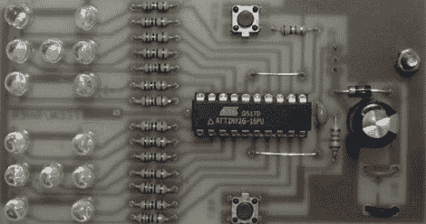

# 阿提尼黑客:用阿提尼掷骰子 2d6

> 原文：<https://hackaday.com/2011/09/16/attiny-hacks-roll-2d6-with-an-attiny/>

[一对六面电子骰子](http://www.circuitsonline.net/schakelingen/140/computer-en-microcontroller/dubbele-dobbelsteen.html)(原文为荷兰语，[这里是](http://translate.google.com/translate?sl=auto&tl=en&js=n&prev=_t&hl=en&ie=UTF-8&layout=2&eotf=1&u=http%3A%2F%2Fwww.circuitsonline.net%2Fschakelingen%2F140%2Fcomputer-en-microcontroller%2Fdubbele-dobbelsteen.html&act=url)谷歌翻译链接)被发送到我们的 ATtiny hacks 主题的举报热线。我们非常欣赏电路的简单性；它真正展示了如何用一个简单的微控制器降低分立器件的复杂性。

电路非常简单 ATtiny26 是项目的核心。14 个发光二极管连接到微处理器上的 14 个引脚。tiny26 可能有点过头了。通过 [Charlieplexing](http://www.maxim-ic.com/app-notes/index.mvp/id/1880) ，我们怀疑这一构建可能已经用类似 ATtiny25 的 8 针微处理器完成。构建的代码(用 BASIC 和 [BASCOM-AVR](http://www.avrfreaks.net/index.php?module=Freaks%20Tools&func=viewItem&item_id=172) 编写)、电路板文件和原理图都已经发布。

我们以前见过一些电子骰子的制作。这个建筑在一个极度紧张的电路中使用了 ATmega328。与[555](http://hackaday.com/2010/10/04/electronic-dice-overkill-and-simplified/)相比，ATtiny26 的建造提供了一个非常好的中间地带。

谢谢[罗兰德]送来这个。