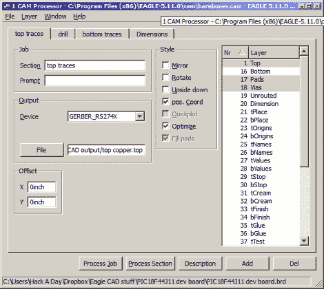

# 视频 Eagle CAD 的 CAM 处理器

> 原文：<https://hackaday.com/2011/09/14/video-eagle-cads-cam-processor/>

这是我们的鹰 CAD 系列视频的下一部分。在本视频中，我们稍微向前跳一下，展示一下 CAM 处理器，您可以用它来创建制造电路板所需的文件。看完这段视频后，你将知道如何创建一个新的 CAM 程序，将电路板装入 CAM 处理器，告诉它保存文件的位置，并实际使用它来创建文件。

因为我们的失误，我们今天跳过了。我们打算今天展示节目的布局部分，但是编辑了错误的视频…我们将在下周展示布局。之后，我们将展示完成的电路板，并将零件焊接在上面。

如果您渴望获得一些 Eagle CAD 布局信息，您可能会对我们上传到 Youtube 频道的一些补充视频感兴趣。在这些视频中，我们展示了如何使用 Eagle CAD 布局部分中最重要的功能。

有没有错过之前的视频？以下是它们的一些链接:

原理图和一个自定义部分的开始:[【点击这里】](http://hackaday.com/2011/08/29/video-learning-eagle-cad-part-i-schematic-custom-parts/)
更多自定义部分的东西:[【点击这里】](http://hackaday.com/2011/09/07/video-learning-eagle-cad-part-2/)

视频被打断后:
 <https://www.youtube.com/embed/yJQUImv-gq8?version=3&rel=1&showsearch=0&showinfo=1&iv_load_policy=1&fs=1&hl=en-US&autohide=2&wmode=transparent>

 </body> </html>