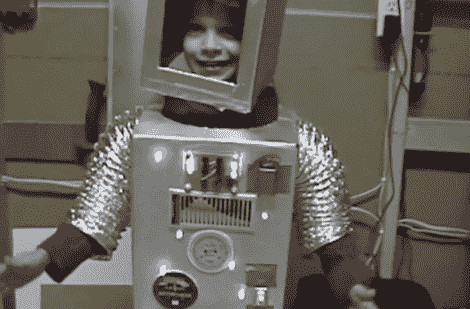

# ATtiny Hacks:机器人万圣节服装

> 原文：<https://hackaday.com/2011/09/24/attiny-hacks-robot-halloween-costume/>

说到万圣节服装，[迈克尔]不喜欢买昂贵的、制作拙劣的、类似于[迪斯尼人物]的布料和织物。去年，他的儿子决定在万圣节扮演一个机器人，尽管灰色喷漆和烘干机排气软管是非常好的服装，但也仅此而已。机器人需要灯光，所以[迈克尔]花了一点时间在这个以随机模式闪烁的 led 上。

建筑非常简单；ATtiny13 驱动两个 74HC595 移位寄存器。这段代码(总共 30 多行)使用 random()函数将高值或低值转移到移位寄存器中。暂停一会儿后，循环继续，一种新的发光二极管点亮。

机器人服装的电子设备可以很容易地转移到另一个主题——宇航员需要在他们的背包上安装 led，当然外星人也可以用闪烁的灯光进行交流。无论如何，它将避免去年十几个希斯·莱杰小丑的惨败。休息之后，请看[迈克尔]的星际机器人儿子的视频。

 <https://www.youtube.com/embed/kLOo2hJF7G8?version=3&rel=1&showsearch=0&showinfo=1&iv_load_policy=1&fs=1&hl=en-US&autohide=2&wmode=transparent>

 </body> </html>