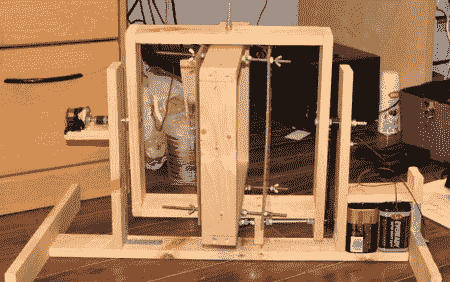

# 一个开源的旋转浇铸机

> 原文：<https://hackaday.com/2011/09/15/an-open-source-rotational-casting-machine/>

[奥雷里奥]写信告诉我们关于[smart caster](http://www.kickstarter.com/projects/aurelio/smartcaster-open-source-automatic-roto-casting-mac)，一种“开源自动旋转浇铸机。”对于那些不熟悉旋转铸造或[旋转成型](http://en.wikipedia.org/wiki/Rotational_molding)的人来说，这是一种将要成型的东西放入模具中，然后在旋转时熔化的过程。这种物品通常是塑料的，但也可以是其他材料，如熟石膏，甚至是巧克力。

自然地，使用这种工艺制造东西通常是非常昂贵的，并且通常需要制造大量的零件。smartCaster Kickstarter 项目旨在改变这种情况。虽然目前处于原型阶段，但[Aurelio]声称只需要 1571 美元就可以完成他的项目，并为未来的家庭旋转成型机做好准备。

虽然这是一个非常不同的工具，但对于正确的项目来说(有人想要自定义复活节兔子吗？)可能会很有用。休息之后，请观看原型运行的视频。

 <https://www.youtube.com/embed/tiRvhQlHdC8?version=3&rel=1&showsearch=0&showinfo=1&iv_load_policy=1&fs=1&hl=en-US&autohide=2&wmode=transparent>

 </body> </html>