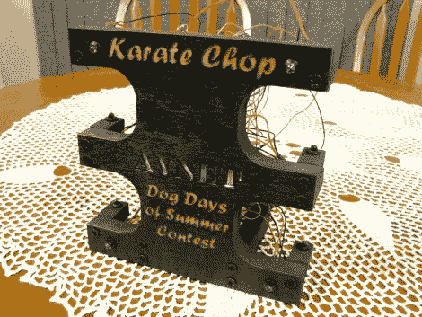

# 空手道劈砍是没有任何接触的西蒙

> 原文：<https://hackaday.com/2011/09/15/karate-chop-is-simon-without-all-the-touching/>

[Alan Parekh]和他的女儿[Alexis]刚刚在 Avnet 夏季三伏天比赛中首次亮相。这是一个叫做空手道砍的游戏，基本上是电子西蒙说的。广告之后的视频展示了该设备的演示。当打开时，它会播放一首小曲，并开始循环表壳前面的发光二极管。玩家通过破坏箱子两侧的两个切口中的红外光束进行互动。你需要把你的手放平来做这个动作，这就是这个名字的由来。游戏开始时有四种不同的游戏模式可供选择。“西蒙说”游戏有两个难度级别，它向玩家展示一种光和声音的模式，然后观察用户重复这种模式。[亚历克西斯]演示的另一种模式是反射游戏，它要求玩家对随机点亮的 led 灯做出快速反应。

该电路建立在隐藏在前挡板后面的试验板上，并使用 PIC 16F1827 微控制器来驱动游戏。该案件本身是由激光切割中密度纤维板和胶合板。我们不确定[艾伦]在这个案子上花了多少时间，但我们认为它看起来很棒。如果你打算参加竞赛，你最好马上开始，报名截止日期是明天。

 <https://www.youtube.com/embed/tKPGgGRFhdk?version=3&rel=1&showsearch=0&showinfo=1&iv_load_policy=1&fs=1&hl=en-US&autohide=2&wmode=transparent>

 </body> </html>