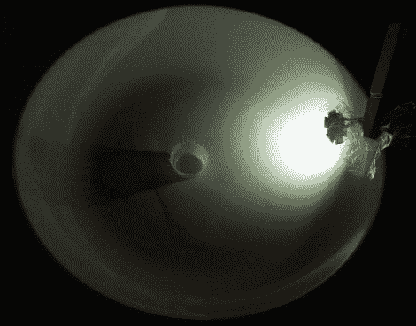

# ATtiny Hacks: DIY 高速摄影 LED 照明设备

> 原文：<https://hackaday.com/2011/09/22/attiny-hacks-diy-high-speed-photography-led-lighting-rig/>

[Tom]想尝试一下高速摄影，需要一些设备来启动。他不想在照明设备或触发装置上花太多钱，决定自己动手制作。在他博客上的[三](http://tomscircuits.blogspot.com/2011/03/low-cost-high-speed-photography-part-1.html) [部分](http://tomscircuits.blogspot.com/2011/03/low-cost-high-apeed-photography-part-2.html) [系列](http://tomscircuits.blogspot.com/2011/03/low-cost-high-speed-photography-part-3.html)中，他详细描述了他的高速设置的构建和测试，以及一路上的改进和经验教训。

他的冒险始于一个小的非品牌 Cree LED 克隆人和一个在他的工作室里积满灰尘的 ATiny15L。他建立了一个简单的电路来触发 LED 来照亮他的对象，在[汤姆的]例子中是一碗牛奶。他没有使用动作或声音触发器，而是选择在底部的碗上安装一个小型压电元件，每当水滴击中碗的表面时，LED 就会发光。

他拍的照片很不错，但他知道他可以得到更好的结果。他购买了一个新的，更强大的 Cree LED，并编写了一个小的终端程序，允许他使用笔记本电脑调整闪光参数。他现在得到的结果要好得多——事实上，他有一整个画廊的照片，你可以去看看。

如果你也想深入研究高速摄影，所有的原理图和代码都可以在他的博客上找到。