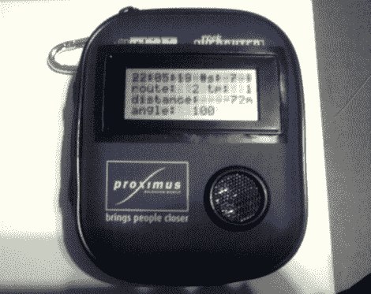

# JGPX 让单身党朝着正确的方向前进，不管 BAC

> 原文：<https://hackaday.com/2011/09/16/jgpx-keeps-the-bachelor-party-moving-in-the-right-direction-regardless-of-bac/>

[Davy]和他的朋友[Chris]的任务是为他们的朋友[J]举办一个单身派对，而[的想法比标准的醉酒狂欢](http://natox.be/blog/index.php/waffle/2011/08/24/jgpx-write-up)要多一点。为了赢得尽情狂欢的特权，他们决定[J]必须完成一系列任务和挑战，然后才能和他的其他朋友一起参加晚上的活动。[戴维]没有具体说明这些任务是什么，以免他破坏了惊喜，但他确实让我们了解了他和[克里斯]建立的一个小设备，以帮助指导单身汉度过他的一天。

他们有点担心，如果单身汉碰巧在旅途中喝了酒，他会在旅途中偏离方向，所以他们建造了一个名为 jGPX 的设备，可以确保[J]保持在正确的轨道上并准时到达。jGPX 是一个定制的 GPS 导航器，由一个 Arduino、一个内置天线的 GPS 模块和一个指南针组成。两人在谷歌地球上创建了一组路线，将数据输出到 KML，由他们的设备进行解释。jGPX 旨在通过一个小的 LCD 屏幕来引导[J],显示他到目标的距离以及到达目标的正确方向。

看起来[J]的朋友们在他的派对上花了很多心血，虽然没有事情进展的细节，但我们确信这是一场狂欢！