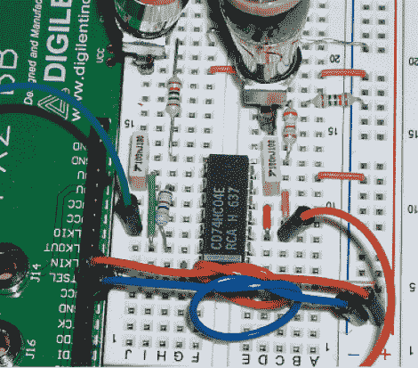

# SPDIF 直通让您数字处理音频

> 原文：<https://hackaday.com/2011/09/16/spdif-passthrough-lets-you-digitally-manipulate-the-audio/>

[Mike Field]将他从过去的几个项目中学到的东西结合起来，制作了这个基于 FPGA 的 SPDIF 音频传递系统。为了让 FPGA 准备好 SPDIF 信号，他需要一些元件来进行电平转换。一旦一切都连接起来，他就使用先进先出(FIFO)缓冲器来确保输出比特率与输入比特率相同，同时仍然允许 FPGA 有足够的时间进行一些数字操作。

这让我们想起了[NeTV](http://hackaday.com/2011/09/12/chumbys-new-netv-makes-almost-any-tv-into-an-internet-connected-device/)，这是一款 HDMI 直通设备。那个可以让你把自己的视频信息叠加到任何有 HDMI 端口的电视上。这将允许你接入任何使用 SPDIF 的音频系统，让你注入自己的音频，如公共大厅的寻呼系统，或当你接到电话时的电话铃声，或创建自己的声音。

我们喜欢他的上手结电缆管理系统，以防止这些跳线在试验板上变得太乱。