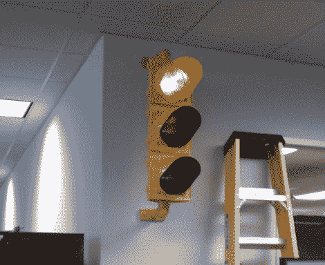

# 当您的服务器陷入困境时，停止灯指示系统会发出信号

> 原文：<https://hackaday.com/2011/09/17/stoplight-indicator-system-signals-when-your-servers-are-in-distress/>

在[mka noap]的办公室，他们有一个监控各种服务器健康状况的软件包，但他们希望有一个单独的指示器来显示他们最关键系统的状态。他们为自己的显示器列出了一个简单的标准列表，包括无需计算机即可查看状态的能力，以及与监控软件使用相同的红/黄/绿指示器。考虑到这些需求(以及几百美元的备用资金)，[mkanoap]和工作人员冲出去买了一个红绿灯，然后去了大楼。

他们的状态系统是独立的，利用 Arduino 和以太网屏蔽来控制交通灯。Arduino 被编程为充当网络服务器，并通过使用继电器切换三个市电灯中的任何一个来响应 GET 请求。[mkanoap]然后创建了一些脚本，每 5 分钟检查一次关键服务器的状态，相应地更新信号灯。在安装到他们办公室的墙上之前，整个装置被整齐地塞在灯的外壳里。

[mkanoap]说，人们对红灯的反应很好，尽管他们不得不安装调光灯泡，这样坐在附近的人就不会瞎了。他的文章非常详细，如果有人想建造一个自己的，谁不想呢？