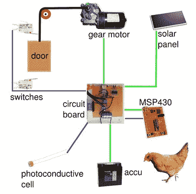

# 太阳能自动鸡舍

> 原文：<https://hackaday.com/2011/09/21/a-solar-powered-automatic-chicken-coop/>

虽然我们在这里展示了许多与鸡相关的技巧，但这个[鸡舍](https://sites.google.com/site/chrisatronics/solar-powered-automated-chicken-coop-door-with-msp430)有一个太阳能门，可以省去人们早上打开鸡舍的麻烦。正如[chrisatronics]所说的“养鸡有一个主要缺点:你必须一大早就和它们一起起床，打开鸡舍的门。每天。包括周日和节假日。”这将有助于解释为什么这么多人似乎在黑他们的合作社。

太阳能本身可能是一个有趣的想法，但当加上鸡舍不一定靠近电源这一事实，这就成了一个非常权宜的解决方案。控制设置的是一个 MSP430 微控制器(编程[功能在这里](http://hackaday.com/2010/08/11/how-to-launchpad-programming-with-linux/)用于 Linux)和一个回收的挡风玻璃刮水器齿轮电机。[Chrisatronics]在编写这个黑客方面做得很好，所以如果你想亲自尝试，一定要看看[的文章](https://sites.google.com/site/chrisatronics/solar-powered-automated-chicken-coop-door-with-msp430)。

此外，别忘了休息后观看“合作行动”的视频！  

<https://player.vimeo.com/video/21311082>

 
另一种早上打开鸡舍的方法，看看这个技巧。或者将它与<a href="http://hackaday.com/2011/09/11/engine-hacks-a-diy-methane-generator/">甲烷发生器</a>结合起来，你马上就能实现能源独立！
 
经由<a href="http://www.43oh.com/2011/09/launchpad-automates-solar-powered-chicken-coop-door/" target="_blank">【430h.com】</a>
 </body> </html>