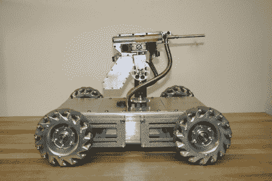

# Mechatron，工业外观的安全机器人

> 原文：<https://hackaday.com/2011/09/18/mechatron-industrial-looking-security-bot/>

这只小怪兽名叫 Mechatron。由一个名为 Beatty Robotics 的父女团队建造，目标是建造一些“复古未来主义、坚韧和工业化”的东西。我们认为他们肯定实现了一些目标。体重接近 50 磅的 Mechatron 仍然非常敏捷，正如你在下面的视频中看到的那样。由于使用了 mechanum 轮，他可以以每分钟近 1000 发的速度向任何方向行进时发射他的枪，这种枪使用黄铜或塑料子弹。8 个测距声纳传感器，一个激光和一个 360 度旋转的炮塔将确保你不会躲避 Mechatron 的警惕的眼睛…和射击。当我们最初争论他们如何使 Mechatron 看起来更具未来感时，我们都同意视频中的灯光帮助很大。或许一件有曲线的衣服也能有所帮助，这取决于他们希望实现的时代。

[通过 [buildlounge](http://www.buildlounge.com/2011/09/18/the-mechatron-will-kick-your-ass/)

<https://player.vimeo.com/video/28464141>

 </body> </html>