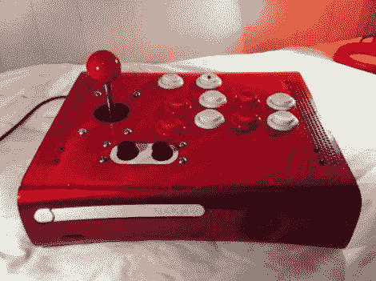

# 破 Xbox 360 改装成街机控制器

> 原文：<https://hackaday.com/2011/09/18/broken-xbox-360-converted-into-an-arcade-controller/>

像许多 Xbox 360s 一样，[Aaron 的]主机屈服于可怕的三个死亡红灯。因为它似乎无法修复，所以除了扔掉它之外，没有什么别的办法。然而，为了避免浪费，亚伦想到了一个再利用游戏机外壳的好方法。

他是格斗游戏的忠实粉丝，众所周知，这种类型的游戏最好用街机风格的控制器来玩。360 的外壳看起来大小刚好合适，所以他把它拆了，开始忙着构建自己的街机控制器。随着控制台被清空，他安装了他所有的街机位，将它们连接到一个剥离的第三方 Xbox 控制器。

他在控制台前面安装了一个四端口 USB 集线器，可以使用 360 的 USB 端口，并重新连接了电源按钮以触发 Xbox Guide 按钮。一层闪亮的油漆之后，他就准备好演奏了。

请继续阅读，观看[Aaron 的] arcade stick 运行的短片，并查看他整理的控制器构造的图片库。

[https://www.youtube.com/embed/3i8GIZNch-0?version=3&rel=1&showsearch=0&showinfo=1&iv_load_policy=1&fs=1&hl=en-US&autohide=2&wmode=transparent](https://www.youtube.com/embed/3i8GIZNch-0?version=3&rel=1&showsearch=0&showinfo=1&iv_load_policy=1&fs=1&hl=en-US&autohide=2&wmode=transparent)